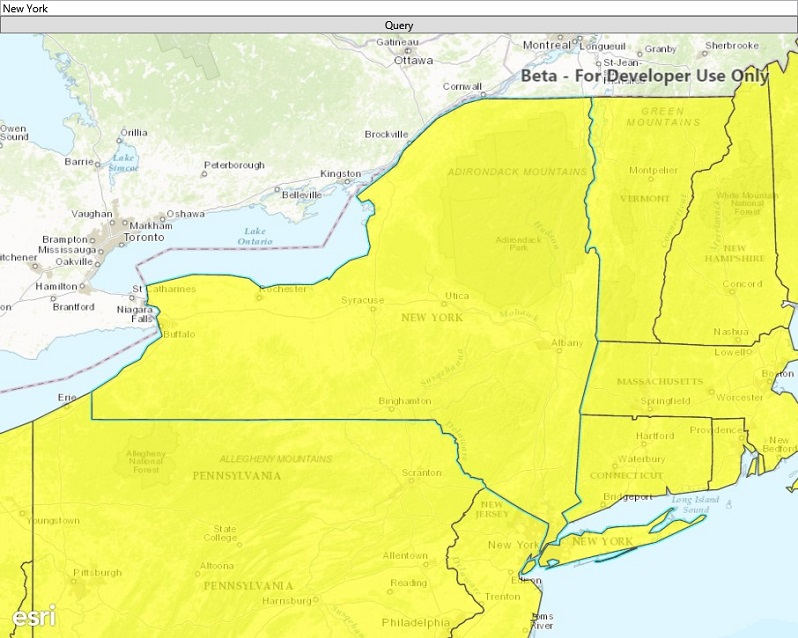

#Generate geodatabase

This sample demonstrates how to take a feature service offline by generating a geodatabase.

### Instructions

Pan and zoom to the area you want to download features for. Make sure the area is within the red block. Tap on the generate button to start the process. The features from the geodatabase are displayed in the map when the download completes. Since editing and data synchronization are not used in the app, the recommended best practice of unregistering the geodatabase is followed.

